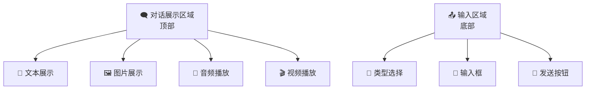

# AI 模型测试聊天界面 PRD

## 📋 项目概述
构建一个 AI 模型测试的交互界面，支持多种媒体类型的生成测试，采用对话形式的用户界面。

## 🏗️ 界面布局

## 🛠️ 功能模块

### 1. 📱 媒体类型选择
- **📝 文本生成** - 对话和文本生成
- **🖼️ 图片生成** - 图片生成和展示
- **🎵 声音生成** - 音频生成和播放
- **🎬 视频生成** - 视频生成和播放

### 2. 🎯 用户交互
- **📤 输入区域** - 文本输入框
- **🔄 类型选择器** - 下拉菜单或按钮组
- **🚀 发送按钮** - 提交生成请求
- **📚 历史记录** - 保存对话历史

### 3. 📺 结果展示
- **📝 文本展示** - 纯文本内容显示
- **🖼️ 图片展示** - 图片预览和查看
- **🎵 音频播放器** - 音频文件播放控制
- **🎬 视频播放器** - 视频文件播放控制
- **⏳ 加载状态** - 生成过程中的loading状态

### 4. 🎭 模拟数据
- **📝 文本模拟** - 返回模拟的文本响应
- **🖼️ 图片模拟** - 返回占位图片或示例图片
- **🎵 音频模拟** - 返回示例音频文件
- **🎬 视频模拟** - 返回示例视频文件
